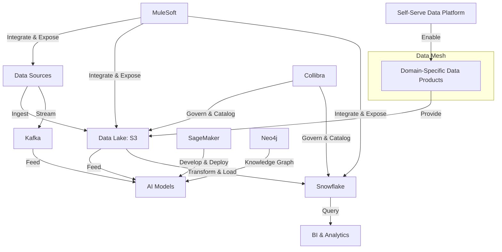

## Background

GlobalLogistics, a leading multinational supply chain and logistics company, had embarked on an ambitious AI and automation initiative to maintain its competitive edge. The company had invested heavily in cutting-edge technologies, including generative AI for optimizing route planning and knowledge graphs for enhancing supply chain visibility.

## Objective

The primary goal was to create a robust and integrated data foundation to fully leverage the company's investments in AI and automation technologies, particularly focusing on enabling generative AI and knowledge graph use cases across the global operation.

## Situation

Despite significant investments in AI technologies, GlobalLogistics faced several challenges in realizing the full potential of these tools:

- **Siloed Data**: Critical data was trapped in disparate systems across different regions and departments.

  _Example: The route optimization AI couldn't access real-time traffic data from local transportation authorities, limiting its effectiveness._

- **Inconsistent Data Formats**: Lack of standardization hindered the creation of comprehensive knowledge graphs.

  _Example: Supplier information was stored differently across regions, making it impossible to build a global supplier risk assessment model._

- **Limited Data Accessibility**: Data scientists struggled to access the data needed to train and refine AI models.

  _Example: Developing a generative AI model for predictive maintenance was delayed by months due to difficulties in collating historical maintenance records from various warehouse systems._

- **Scalability Issues**: Existing infrastructure couldn't handle the computational demands of advanced AI algorithms.

  _Example: Running complex simulations for network optimization would often crash the system, forcing reliance on outdated, less sophisticated methods._

## Task

As the Enterprise Data Architect, I was tasked with:

1. Designing a scalable, cloud-based data architecture to unify global data sources.
2. Implementing data governance practices to ensure data consistency and quality.
3. Creating a flexible data integration layer to support various AI and analytics use cases.
4. Establishing a robust data catalog to improve data discovery and accessibility.

[Previous sections remain the same]

## Action

1. **Cloud-based Data Lake Implementation**

   - Implemented a data lake using Amazon S3 for raw data storage.
   - Chose S3 for its scalability, cost-effectiveness, and seamless integration with other AWS services crucial for AI workloads.

   _Example: Developed a data ingestion pipeline that captured real-time IoT data from warehouse robots, storing it in S3 for immediate use in predictive maintenance models._

   _Challenge: The existing on-premises data storage couldn't handle the volume and variety of data required for AI models. Moving to S3 allowed us to store unstructured data like images from quality control cameras and text from customer feedback, which were crucial for training comprehensive AI models._

2. **Data Governance and Quality Framework**

   - Leveraged existing Collibra installation, previously underutilized, for data cataloging and governance.
   - Expanded Collibra's use to include automated data quality checks and a business glossary.

   _Example: Created a standardized global ontology for supply chain entities, enabling the construction of a comprehensive knowledge graph of suppliers, warehouses, and transportation routes._

   _Challenge: While Collibra was already in place, it was primarily used for basic data inventory. We had to overcome significant organizational inertia to implement more advanced features. This involved extensive training and the creation of a data stewardship program across departments._

3. **Real-time Data Integration Layer**

   - Implemented Apache Kafka on Amazon MSK for real-time data streaming.
   - Chose Kafka for its high throughput and low-latency, essential for real-time AI decision making.
   - Deployed MuleSoft as the API management layer.
   - Selected MuleSoft for its strong integration capabilities and API-led connectivity approach, facilitating easier access to data for AI models.

   _Example: Developed a real-time event streaming pipeline using Kafka to feed live GPS data from delivery vehicles into the route optimization AI, enabling dynamic rerouting based on current conditions._

   _Challenge: The existing point-to-point integrations couldn't handle real-time data flows needed for AI. Implementing Kafka required significant changes to data producers and consumers across the organization. We had to carefully manage this transition to avoid disrupting ongoing operations._

4. **Scalable Analytics Platform**

   - Migrated from Amazon Redshift to Snowflake for the data warehouse.
   - Chose Snowflake for its superior scalability, multi-cluster shared data architecture, and ability to separate storage and compute resources.

   _Example: Built a centralized repository of historical delivery data in Snowflake, allowing data scientists to easily train and refine the generative AI model for delivery time predictions._

   _Reason for Migration: While Redshift served us well initially, as our AI workloads grew, we faced challenges with concurrency and resource allocation. Snowflake's ability to scale compute independently of storage allowed us to run complex AI queries without impacting operational reporting. Its native support for semi-structured data also simplified our ETL processes for JSON and XML data from various logistics systems._

5. **Knowledge Graph Implementation**

   - Deployed Neo4j as the graph database to support knowledge graph use cases.
   - Selected Neo4j for its native graph storage and Cypher query language, optimizing performance for complex relationship queries.

   _Example: Constructed a global supply chain knowledge graph in Neo4j, integrating supplier, inventory, and logistics data to enable AI-driven risk assessment and opportunity identification._

   _Challenge: Implementing a knowledge graph was difficult primarily due to data quality and integration issues. Our data was siloed and often inconsistent, making it hard to establish reliable relationships between entities. We had to:_

   1. _Develop a comprehensive data cleansing pipeline to standardize entity references across systems._
   2. _Create a robust entity resolution system to accurately link data about the same real-world entities from different sources._
   3. _Design a flexible schema that could accommodate the complexity of our global supply chain while remaining performant for AI queries._
   4. _Implement a continuous integration process to keep the knowledge graph updated with the latest operational data._

6. **AI Model Development and Deployment Infrastructure**

   - Implemented Amazon SageMaker for end-to-end machine learning operations (MLOps).
   - Chose SageMaker for its integrated development environment, built-in algorithms, and model deployment capabilities.

   _Example: Developed and deployed a generative AI model for creating optimal loading plans for shipments, considering factors like package dimensions, weight distribution, and destination._

   _Challenge: Prior to this implementation, our data scientists were using a hodgepodge of tools and manual processes to develop and deploy models. This led to long development cycles and difficulties in maintaining model performance in production. SageMaker allowed us to standardize the ML lifecycle, but required significant upskilling of our team and refactoring of existing models._

7. **Data Mesh Implementation**

   - Adopted a data mesh architecture to decentralize data ownership and improve scalability.
   - Implemented domain-oriented data teams responsible for their data products.

   _Example: Created a "Last Mile Delivery" data product team, responsible for all data related to final delivery processes. This team now provides clean, reliable data as a service to other teams and AI models._

   _Challenge: Moving to a data mesh architecture required a significant cultural shift. We had to:_

   1. _Redefine roles and responsibilities across the organization._
   2. _Implement new processes for data quality assurance and cross-domain data standardization._
   3. _Develop a federated governance model that balanced local autonomy with global consistency._
   4. _Create a self-serve data infrastructure that allowed domain teams to easily publish and consume data products._

Each of these actions was crucial in creating an integrated data foundation capable of supporting our advanced AI initiatives. The challenges we faced in implementation were significant, but overcoming them has positioned us to fully leverage AI across our global operations.

## Result

The implementation of this enhanced data architecture yielded significant improvements:

1. **Improved AI Model Performance**: Enhanced data accessibility and quality led to more accurate AI predictions.

   _Example: The route optimization AI, now with access to comprehensive data, improved delivery time accuracy by 23% and reduced fuel consumption by 15%._

2. **Accelerated AI Development**: Streamlined data access reduced the time required to develop and deploy new AI models.

   _Example: Development time for new predictive maintenance models decreased from months to weeks, allowing for rapid iteration and improvement._

3. **Enhanced Supply Chain Visibility**: The knowledge graph implementation provided unprecedented insights into supply chain relationships.

   _Example: Proactive identification of potential supply chain disruptions increased by 40%, allowing for timely mitigation strategies._

4. **Scalable AI Operations**: The new infrastructure supported the computational demands of advanced AI algorithms.

   _Example: Complex network optimization simulations that previously took days now complete in hours, enabling more frequent and comprehensive scenario planning._

5. **Improved Data Scientist Productivity**: The data catalog and governance framework significantly reduced time spent on data discovery and preparation.

   _Example: Data scientists reported spending 30% less time on data wrangling and 40% more time on model development and refinement._

## Key Skills Demonstrated

- Cloud-based data architecture design
- Data governance in complex, AI-driven environments
- Real-time data integration for AI applications
- Knowledge graph design and implementation
- Scalable analytics platform development

## Conclusion

This project demonstrates how a well-designed data architecture can unlock the full potential of AI and automation technologies in a global logistics context. By focusing on data integration, quality, and accessibility, we transformed our data infrastructure into a powerful enabler for AI innovation, directly contributing to GlobalLogistics' operational efficiency and competitive advantage in the AI-driven future of logistics.
