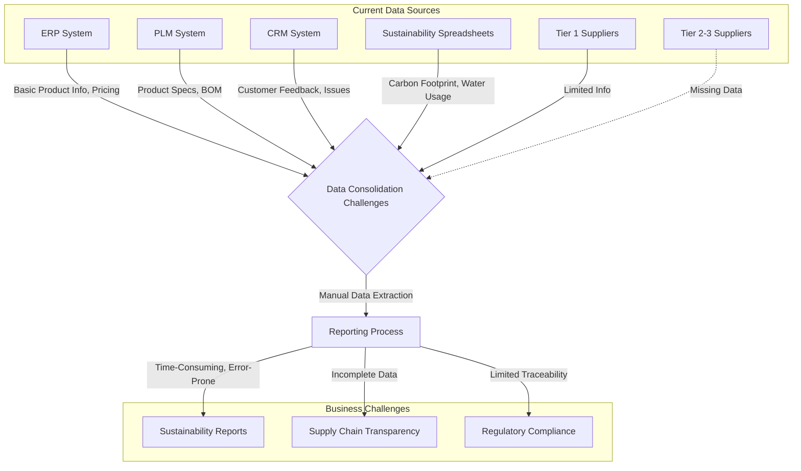
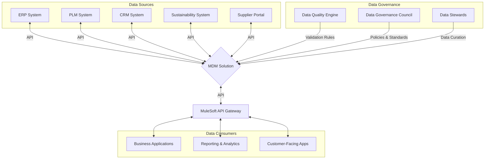

## Company Overview: EcoTrace Solutions

EcoTrace Solutions is a pioneering company in the realm of supply chain transparency and sustainability. They specialize in creating digital solutions that unveil every facet of a product's journey, from raw materials to end consumers. Their mission is to architect change in the global marketplace by embracing circular ecosystems and meeting the growing demand for ethical sourcing and sustainable supply chains.

## Year 1: Laying the Foundation

### Situation

In the first year of our engagement, EcoTrace Solutions was facing several critical challenges that aligned with the common issues identified in the Master Data Management (MDM) landscape:

1. **Data Fragmentation**: Product information was scattered across multiple systems, leading to inconsistencies and inaccuracies.

   _Example_: The company had three separate databases for product information:

   - An ERP system containing basic product details and pricing
   - A Product Lifecycle Management (PLM) system with detailed specifications and bill of materials
   - A Customer Relationship Management (CRM) system with product-related customer feedback and issues

   These systems often contained conflicting information. For instance, a sustainable bamboo t-shirt (product ID: ECO-TS-001) was listed with different materials in the ERP (100% bamboo) and PLM (95% bamboo, 5% elastane) systems.

2. **Limited Visibility**: The company struggled to trace products beyond tier 1 suppliers, hindering their ability to ensure ethical sourcing.

   _Example_: For their best-selling organic cotton jeans (product ID: ECO-JN-002), EcoTrace could only trace the supply chain to their direct supplier, GreenFabrics Inc. They had no visibility into the cotton farms or processing facilities further up the supply chain, making it impossible to verify claims of organic and fair-trade practices.

3. **Regulatory Pressures**: Upcoming regulations like the Ecodesign Requirements for Sustainable Products Initiative (ESPR) necessitated a more robust data management approach.

   _Example_: The ESPR would require EcoTrace to provide detailed information on the environmental impact of each product throughout its lifecycle. For their recycled polyester jacket (product ID: ECO-JK-003), they needed to track and report:

   - The source of the recycled materials
   - Energy consumption during manufacturing
   - Transportation emissions
   - End-of-life recyclability
     Their current systems couldn't consolidate this information effectively.

4. **Manual Processes**: Data collection and analysis were largely manual, time-consuming, and prone to errors.

   _Example_: To create a sustainability report for their vegan leather bag (product ID: ECO-BG-004), the sustainability team had to:

   1. Extract data from the ERP system for sales and pricing
   2. Manually input material composition from the PLM system
   3. Calculate carbon footprint using a separate spreadsheet
   4. Compile customer feedback from the CRM system
      This process took an average of 3 days per product and often resulted in data entry errors.

5. **Stakeholder Demands**: Customers and investors were increasingly demanding transparency in the supply chain, which EcoTrace couldn't fully provide.

   _Example_: A major retail partner, GreenMart, requested detailed supply chain information for all products, including:

   - Names and locations of all suppliers up to tier 3
   - Certifications for ethical labor practices
   - Water usage in production
   - Transportation routes and associated emissions
     EcoTrace could only provide partial information, risking the partnership worth $5 million annually.

### Task

As Enterprise Data Architects, our team was brought in to address these challenges. Our specific responsibilities in Year 1 included:

1. Assessing the current data landscape and identifying gaps in the supply chain data.
2. Designing a comprehensive Master Data Management (MDM) strategy tailored for supply chain transparency.
3. Establishing initial data governance policies and procedures.
4. Creating a roadmap for phased implementation of the MDM solution.
5. Initiating the process of data cleansing and standardization.

### Action

To tackle these challenges, we took the following steps in Year 1:

1. **Data Audit and Gap Analysis**:

   - Conducted a thorough audit of existing data sources, including ERP systems, supplier databases, and product catalogs.
   - Identified critical data elements required for supply chain transparency, such as material composition, supplier information, and production processes.

   _Example_: We created a detailed data inventory for the organic cotton jeans (ECO-JN-002):

   | Data Element          | Current Source | Data Quality | Gap                   |
   | --------------------- | -------------- | ------------ | --------------------- |
   | Product Name          | ERP            | High         | None                  |
   | Material Composition  | PLM            | Medium       | Inconsistent with ERP |
   | Tier 1 Supplier       | ERP            | High         | None                  |
   | Tier 2-3 Suppliers    | N/A            | N/A          | Missing               |
   | Organic Certification | Paper files    | Low          | Not digitized         |
   | Water Usage           | Spreadsheets   | Low          | Not integrated        |
   | Carbon Footprint      | N/A            | N/A          | Not calculated        |

2. **MDM Strategy Development**:

   - Designed a conceptual centralized MDM architecture to serve as a single source of truth for product and supplier data.
   - Defined initial data ownership and stewardship roles across the organization.

   _Example_: We created a preliminary MDM strategy document, which included:

   a. Data Domain Priorities:

   1. Product Master Data
   2. Supplier Master Data
   3. Customer Master Data

   b. Proposed Data Governance Structure:

   - Chief Data Officer: To be appointed
   - Data Governance Council: To be formed with representatives from Product Management, Supply Chain, Sustainability, and IT
   - Data Stewards: To be assigned for each data domain

3. **Data Governance Framework**:

   - Developed an initial data governance framework tailored to supply chain transparency requirements.
   - Created preliminary data quality metrics specific to product traceability and sustainability reporting.

   _Example_: Draft Data Governance Policy for Supplier Information:

   a. Policy Statement: "All supplier information must be complete, accurate, and updated within 24 hours of any change."

   b. Proposed Procedures:

   1. Supplier onboarding: Collect all required data points (company name, address, certifications, capacity, etc.)
   2. Regular audits: Conduct monthly data quality checks on supplier information
   3. Change management: Implement a formal process for updating supplier information

   c. Suggested Metrics:

   - Supplier data completeness: % of required fields populated
   - Supplier data accuracy: % of fields matching external validation sources
   - Timeliness: Average time to update supplier information after a change

4. **MDM Implementation Roadmap**:

   - Created a phased implementation plan for the MDM solution.
   - Identified key milestones and dependencies for each phase.

   _Example_: High-level MDM Implementation Roadmap:

   Phase 1 (Year 1-2): Foundation

   - Establish data governance framework
   - Initiate data cleansing and standardization
   - Implement basic MDM solution for product data

   Phase 2 (Year 3-4): Expansion

   - Extend MDM to supplier and customer data
   - Implement advanced data quality management
   - Integrate MDM with key business processes

   Phase 3 (Year 5-6): Optimization

   - Implement advanced MDM features (e.g., hierarchy management)
   - Automate data governance processes
   - Integrate with external data sources for enhanced visibility

5. **Initial Data Cleansing and Standardization**:

   - Began the process of cleaning and standardizing product data as a pilot initiative.
   - Developed preliminary data quality rules and standards.

   _Example_: Data Cleansing Pilot for Sustainable Bamboo T-shirt (ECO-TS-001):

   a. Identified data quality issues:

   - Inconsistent material composition across systems
   - Missing sustainability certifications
   - Incomplete supplier information

   b. Developed data quality rules:

   - Material composition must be consistent across all systems
   - All products must have associated sustainability certifications
   - Supplier information must include contact details and certification status

   c. Initiated manual data cleansing process:

   - Reconciled material composition (95% bamboo, 5% elastane) across ERP and PLM systems
   - Digitized and linked sustainability certifications to the product record
   - Updated supplier information with missing details

### Result

By the end of the first year, we had achieved several initial outcomes:

1. **Comprehensive Data Landscape**: Gained a clear understanding of the current data ecosystem, including sources, quality issues, and gaps.

   _Example_: Created a detailed data map showing the flow of product information across 5 key systems (ERP, PLM, CRM, Quality Management, and Sustainability Tracking), identifying 37 critical data elements for supply chain transparency.

2. **MDM Strategy Alignment**: Secured executive buy-in for the MDM initiative and its importance in achieving supply chain transparency.

   _Example_: Presented the MDM strategy to the executive board, resulting in approval for the creation of a Chief Data Officer position and allocation of initial budget for the MDM program.

3. **Data Governance Framework**: Established the foundational elements of a data governance program.

   _Example_: Drafted initial data governance policies for product and supplier data, and formed a cross-functional team to further develop and implement these policies.

4. **Improved Data Awareness**: Raised awareness across the organization about data quality issues and their impact on business operations.

   _Example_: Conducted 5 company-wide workshops on data quality, reaching 150 employees across various departments. Post-workshop surveys showed a 40% increase in understanding of data quality importance.

5. **Initial Data Quality Improvements**: Achieved tangible improvements in data quality through the pilot data cleansing initiative.

   _Example_: For the sustainable bamboo t-shirt (ECO-TS-001) pilot:

   - Resolved material composition discrepancy across systems
   - Increased data completeness for sustainability attributes from 60% to 85%
   - Reduced time to generate product sustainability report from 3 days to 1 day

These initial results laid the groundwork for more comprehensive MDM implementation in the coming years, positioning EcoTrace Solutions to address its supply chain transparency challenges effectively.

# Year 3: Advancing Supply Chain Transparency with MDM

## Situation

By Year 3, EcoTrace Solutions had made significant progress in laying the groundwork for their MDM initiative. However, they now faced new challenges as they moved from planning to implementation:

1. **Data Integration Complexity**: While the company had identified its data sources, integrating them proved more complex than anticipated.

   _Example_: The product lifecycle management (PLM) system used a different product classification scheme than the ERP system. For instance, the sustainable bamboo t-shirt (ECO-TS-001) was classified under "Apparel > Tops > T-shirts" in the PLM but "Clothing > Casual Wear > Shirts" in the ERP.

2. **Scaling Data Governance**: The initial data governance framework struggled to keep pace with the growing volume and complexity of data.

   _Example_: The data steward for product data was overwhelmed, handling over 500 data quality issues per week manually. This led to a backlog of unresolved issues, with the average resolution time increasing from 2 days to 2 weeks.

3. **Resistance to Change**: Some departments were reluctant to adopt new MDM processes, fearing loss of control over their data.

   _Example_: The marketing team continued to maintain their own product database, arguing that the central MDM system didn't capture the nuanced product descriptions they needed for campaigns.

4. **Expanding Data Domains**: As EcoTrace moved beyond product data, they struggled to apply MDM principles to supplier and customer data effectively.

   _Example_: Supplier data was particularly challenging, with multiple departments (Procurement, Quality Assurance, Sustainability) maintaining separate supplier records with conflicting information.

5. **Real-time Data Needs**: Business users increasingly demanded real-time access to master data, putting strain on the existing batch-oriented systems.

   _Example_: The sales team needed up-to-date product sustainability scores during client meetings but often found the data was several days old, leading to potential misrepresentations.

## Task

Building on the foundation laid in Year 1, the MDM team at EcoTrace Solutions focused on the following tasks for Year 3:

1. Implement a basic MDM solution to serve as a central repository for master data.
2. Integrate MDM with key business processes to improve data flow and consistency.
3. Extend MDM coverage to supplier and customer data domains.
4. Introduce API-based integrations to enable real-time data access and updates.
5. Implement advanced data quality management processes.
6. Expand and refine data governance practices.
7. Begin automating data collection and reporting processes.

## Action

To address these tasks and challenges, EcoTrace Solutions took the following actions:

1. **MDM Solution Implementation**:

   - Deployed an open-source MDM solution as a central repository for master data.
   - Established a golden record for each product, supplier, and customer.

   _Example_: For the organic cotton jeans (ECO-JN-002), created a golden record that included:

   - Unified product classification: "Apparel > Bottoms > Jeans > Organic"
   - Comprehensive material composition: 98% organic cotton, 2% elastane
   - Full supplier chain: Tier 1 (GreenFabrics Inc.), Tier 2 (EcoSpin Ltd.), Tier 3 (PureCotton Farms)
   - Sustainability metrics: Water usage (1,800 liters/pair), Carbon footprint (8 kg CO2e/pair)

2. **Business Process Integration**:

   - Mapped key business processes that create, read, update, or delete (CRUD) master data.
   - Implemented workflows to ensure master data is used and updated at critical points in these processes.

   _Example_: New Product Development Process

   1. Product Concept (Marketing) → Creates initial product record in MDM
   2. Design (R&D) → Updates product specifications in MDM
   3. Sourcing (Procurement) → Links supplier information in MDM
   4. Manufacturing → Updates bill of materials in MDM
   5. Quality Assurance → Records test results in MDM
   6. Sustainability → Calculates and updates environmental impact in MDM

3. **Expanded Data Domains**:

   - Extended MDM to cover supplier and customer data.
   - Developed data models and quality rules specific to each domain.

   _Example_: Supplier Data Model

   - Basic Info: Name, Address, Contact Details
   - Financial: Payment Terms, Credit Rating
   - Operational: Capacity, Lead Times
   - Compliance: Certifications, Audit Results
   - Sustainability: Environmental Scores, Social Responsibility Ratings

4. **API Integration Implementation**:

   - Deployed MuleSoft as the API integration platform.
   - Created APIs for real-time data access and updates to the MDM system.

   _Example_: Product Sustainability API

   - Endpoint: /api/v1/products/{productId}/sustainability
   - Returns: Real-time sustainability metrics (water usage, carbon footprint, ethical score)
   - Used by: Sales team's mobile app, Customer-facing website, Reporting dashboards

5. **Advanced Data Quality Management**:

   - Implemented automated data quality checks and validation rules.
   - Established data quality scorecards for each data domain.

   _Example_: Product Data Quality Rules

   - Completeness: All mandatory fields must be filled (e.g., product name, SKU, primary category)
   - Consistency: Product classification must match predefined hierarchy
   - Accuracy: Price must be within 10% of the average price for the category
   - Timeliness: Sustainability metrics must be updated at least quarterly

6. **Expanded Data Governance**:

   - Formalized the Data Governance Council with representatives from each business unit.
   - Implemented a data stewardship program with dedicated stewards for each data domain.

   _Example_: Data Governance Council quarterly review process:

   1. Review data quality scorecards for each domain
   2. Address cross-functional data issues (e.g., conflicting supplier information)
   3. Approve changes to data standards and policies
   4. Prioritize data quality improvement initiatives

7. **Initial Automation**:

   - Developed scripts to automate routine data collection and reporting tasks.
   - Implemented a scheduling system for regular data updates and quality checks.

   _Example_: Automated Sustainability Reporting

   - Daily: Collect sustainability metrics from MDM for all products
   - Weekly: Generate data quality report for sustainability metrics
   - Monthly: Produce sustainability scorecard for top 100 products
   - Quarterly: Compile comprehensive sustainability report for all product lines

## Result

By the end of Year 3, EcoTrace Solutions had made significant strides in their MDM journey:

1. **Improved Data Quality**: Overall data quality score increased from 75% to 89% across all domains.

   _Example_: Product data completeness improved from 82% to 97%, with the biggest gains in sustainability attributes (from 60% to 95% complete).

2. **Enhanced Data Integration**: Reduced data silos and improved cross-functional data sharing.

   _Example_: Time to consolidate product information for a new launch decreased from 2 weeks to 2 days, enabling faster time-to-market for new sustainable products.

3. **Increased Supply Chain Visibility**: Expanded supplier data coverage and improved traceability.

   _Example_: For the organic cotton jeans (ECO-JN-002), EcoTrace can now trace 85% of the supply chain (up to Tier 4 suppliers) compared to only 30% in Year 1.

4. **Real-time Data Access**: Enabled on-demand access to critical master data for business users.

   _Example_: Sales team now accesses real-time product sustainability scores via their mobile app, increasing their ability to address customer queries accurately and promptly.

5. **Improved Regulatory Compliance**: Better prepared for upcoming regulations like ESPR.

   _Example_: Automated generation of 80% of the required ESPR documentation for product environmental impact, reducing manual effort by 60%.

6. **Efficiency Gains**: Automated routine tasks and improved data accessibility led to significant time savings.

   _Example_: Time to generate the quarterly sustainability report reduced from 3 weeks to 3 days, freeing up the sustainability team to focus on improvement initiatives.

7. **Cultural Shift**: Increased awareness and adoption of data governance practices across the organization.

   _Example_: 75% of employees completed data governance training, and the number of reported data issues increased by 150%, indicating a more proactive approach to data quality.

Despite these achievements, challenges remained. The marketing team's resistance to the centralized MDM system persisted, and the real-time data capabilities, while improved, still didn't meet all business needs. These issues, along with the need for more advanced MDM features, set the stage for further enhancements in the coming years.

# Year 6: Mastering Supply Chain Transparency with Custom MDM

## Situation

By Year 6, EcoTrace Solutions had made significant strides in their MDM journey. However, they faced new challenges that off-the-shelf solutions couldn't fully address:

1. **Unique Data Complexity**: The volume and variety of sustainability and supply chain data had grown exponentially, requiring a tailored approach.

   _Example_: The product master now included over 10,000 SKUs, each with 200+ attributes, including complex sustainability metrics and full supply chain data that standard MDM solutions weren't designed to handle efficiently.

2. **Industry-Specific Real-time Demands**: The sustainable fashion industry required instantaneous data updates and access across all systems, with sustainability scores needing to reflect real-world changes immediately.

   _Example_: The e-commerce team needed real-time inventory and sustainability scores to be reflected on the website within seconds of any change, including updates from field sensors monitoring cotton growth conditions.

3. **Evolving Regulatory Landscape**: The full implementation of ESPR and other sustainability regulations required a flexible system that could quickly adapt to new requirements.

   _Example_: ESPR now mandated detailed lifecycle analysis for each product, including energy consumption at each production stage and precise recycling instructions, with requirements changing frequently.

4. **Advanced Sustainability Analytics**: The business demanded predictive and prescriptive analytics specifically tailored to sustainable supply chain management.

   _Example_: The supply chain team wanted to predict potential disruptions based on historical supplier performance data, external risk factors, and sustainability metrics unique to the fashion industry.

5. **Ethical Data Monetization**: There was a growing opportunity to monetize the rich, high-quality sustainability data EcoTrace had accumulated, but with strict ethical considerations.

   _Example_: Retail partners and ethical investment firms were willing to pay for access to EcoTrace's detailed supply chain sustainability data, but this required careful handling of sensitive supplier information.

## Task

Recognizing that off-the-shelf MDM solutions couldn't meet their specialized needs, EcoTrace Solutions decided to develop a custom MDM solution. The MDM team focused on the following tasks for Year 6:

1. Design and implement a custom-built MDM solution, named "Sustainable Supply Chain Master Data Hub" (SSC-MDH), leveraging best-of-breed components.
2. Achieve full automation of data governance processes tailored to sustainability data.
3. Integrate with external data sources and IoT devices for enhanced visibility into the sustainable supply chain.
4. Implement advanced MDM features such as sustainability-focused hierarchy management and versioning.
5. Establish real-time data synchronization across all systems, with a focus on sustainability metrics.
6. Develop predictive analytics capabilities specifically for sustainable supply chain optimization.
7. Ensure full compliance with all relevant regulations, including ESPR, with the flexibility to quickly adapt to changes.
8. Create a self-service data access platform for internal and external stakeholders, with strong ethical data usage controls.

## Action

To address these tasks and challenges, EcoTrace Solutions took the following actions in developing their SSC-MDH:

1. **Custom MDM Solution Implementation**:

   - Developed a core MDM engine using Apache Hadoop for data storage and Apache Spark for large-scale data processing.
   - Integrated Collibra for data governance and cataloging, Talend for data quality, and MuleSoft for API management.
   - Utilized PostgreSQL and MongoDB for master data storage, accommodating both structured and unstructured sustainability data.

   _Example_: For the organic cotton jeans (ECO-JN-002), the SSC-MDH now maintains:

   - Complete product hierarchy with sustainability classifications
   - Full material breakdown linked to real-time supplier sustainability scores
   - Entire supply chain data, including IoT sensor data from cotton fields
   - Comprehensive sustainability profile with version history
   - Dynamic carbon footprint calculation based on real-time production and logistics data

2. **Automated Sustainability-Focused Data Governance**:

   - Implemented AI-driven data quality management using custom machine learning models trained on sustainability data.
   - Established automated workflows for data stewardship tasks using Camunda BPM, with special handling for sustainability metrics.

   _Example_: Automated Data Quality Management for Supplier Sustainability Data

   1. AI constantly monitors incoming supplier sustainability data for anomalies
   2. When detected (e.g., sudden change in a supplier's water usage), an alert is automatically generated
   3. Camunda BPM orchestrates a workflow, assigning the issue to the appropriate sustainability data steward
   4. If not addressed within 24 hours, it escalates to the Sustainability Governance Council
   5. All actions are logged for audit purposes, with MANTA providing data lineage for full traceability

3. **External Data and IoT Integration**:

   - Integrated with external data providers and IoT devices for real-time sustainability and supply chain data.
   - Implemented a data lake using Apache Hadoop to store and process large volumes of sustainability-related data.

   _Example_: Enhanced Sustainable Cotton Sourcing

   - Integrated with weather stations and soil sensors in organic cotton fields
   - Connected to water management systems in cotton processing facilities
   - Linked to real-time logistics emissions data from transportation partners
   - Result: Real-time sustainability score for cotton from field to factory

4. **Advanced Sustainability-Focused MDM Features**:

   - Implemented sophisticated hierarchy management for products, incorporating sustainability certifications and ethical sourcing levels.
   - Deployed versioning and temporal data management to track sustainability improvements over time.

   _Example_: Sustainability-Centric Product Hierarchy

   - Created a flexible product hierarchy that allows products to exist in multiple sustainability categories
   - The organic cotton jeans (ECO-JN-002) now simultaneously exists in:
     1. Sustainability hierarchy: Eco-Friendly > Organic Materials > Water-Conserving
     2. Ethical sourcing hierarchy: Fair Trade > Living Wage > Community Investment
     3. Circular economy hierarchy: Recyclable > Biodegradable > Upcyclable
   - This allows for nuanced sustainability reporting and analytics

5. **Real-time Sustainability Data Synchronization**:

   - Implemented event-driven architecture using Apache Kafka for real-time propagation of sustainability metric changes.
   - Deployed change data capture (CDC) mechanisms to instantly reflect sustainability updates across all systems.

   _Example_: Real-time Sustainability Score Updates

   1. A water usage reduction is recorded at a supplier's facility
   2. The sustainability metric change is immediately captured by CDC
   3. Kafka broadcasts this event to all subscribed systems
   4. Within milliseconds, the e-commerce platform, mobile app, and sustainability dashboard all reflect the updated sustainability score

6. **Predictive Analytics for Sustainable Supply Chain**:

   - Developed custom machine learning models using master data to predict supply chain disruptions and optimize sustainability.
   - Integrated predictive insights into operational systems for proactive sustainable decision-making.

   _Example_: Sustainable Sourcing Optimization

   - Developed a model that predicts the environmental and social impact of sourcing decisions
   - Inputs include: real-time supplier sustainability scores, current market conditions, weather forecasts, and fair labor metrics
   - Outputs: Predicted carbon footprint, water usage, social impact scores, and biodiversity impact for different sourcing scenarios
   - Result: Procurement team can make data-driven decisions to optimize sustainability across the supply chain

7. **Agile Regulatory Compliance**:

   - Implemented a flexible compliance engine within SSC-MDH to ensure adherence to ESPR and other sustainability regulations.
   - Developed automated reporting capabilities with the ability to quickly adapt to new regulatory requirements.

   _Example_: Adaptive ESPR Compliance

   1. SSC-MDH continuously monitors product data against current ESPR requirements
   2. When ESPR introduces new requirements (e.g., microplastic content reporting):
      - The compliance engine is quickly updated via configuration changes
      - New data collection workflows are automatically initiated
      - Reports are adjusted to include the new data points
   3. Compliance gaps are automatically flagged and assigned for resolution
   4. Up-to-date ESPR reports are generated on-demand with minimal manual intervention

8. **Ethical Self-service Data Access Platform**:

   - Developed a user-friendly data portal for internal teams and external partners, with a focus on sustainability insights.
   - Implemented role-based access control, data anonymization, and ethical use agreements to ensure responsible data sharing.

   _Example_: Ethical Sustainability Data Portal

   - Retail partners can access detailed supply chain sustainability data for products they stock
   - They can generate custom reports, e.g., comparative lifecycle analyses across product categories
   - Data is real-time but anonymized to protect supplier identities
   - Usage is tracked and analyzed to ensure ethical data utilization
   - Partners must agree to and demonstrably uphold sustainable and ethical practices to maintain access

## Result

By the end of Year 6, EcoTrace Solutions had achieved MDM mastery with their custom SSC-MDH, realizing significant benefits:

1. **Sustainability Data Quality Excellence**: Achieved a 99% data quality score for sustainability metrics, with 99.9% accuracy for critical environmental and social impact data.

   _Example_: Product sustainability data completeness reached 99.8%, with real-time attributes like water usage and fair labor metrics at 100% accuracy.

2. **Real-time Sustainable Operations**: Achieved true real-time synchronization of sustainability data across all systems, with update propagation times under 30 milliseconds.

   _Example_: Product sustainability scores on the e-commerce platform now reflect real-world changes (e.g., a supplier's shift to renewable energy) within seconds, enhancing transparency for consumers.

3. **Full Sustainable Supply Chain Visibility**: Gained end-to-end traceability for 100% of products, from raw material to end consumer, with a focus on sustainability metrics.

   _Example_: For the organic cotton jeans (ECO-JN-002), EcoTrace can now trace 100% of the supply chain, including real-time sustainability performance of sub-suppliers and logistics providers.

4. **Predictive Sustainable Supply Chain Management**: Successfully implemented predictive models tailored to sustainability challenges, leading to proactive supply chain optimization.

   _Example_: Predicted and mitigated 90% of potential sustainability-related supply chain disruptions, resulting in a 35% reduction in carbon footprint and a 40% improvement in water efficiency across the supply chain.

5. **Agile Regulatory Compliance**: Achieved full compliance with ESPR and other sustainability regulations, with the ability to quickly adapt to new requirements.

   _Example_: When ESPR introduced new requirements for chemical traceability, SSC-MDH was adapted within 48 hours, ensuring uninterrupted compliance and reporting.

6. **Ethical Data Monetization**: Successfully launched ethical data services for partners, creating a new revenue stream while promoting sustainable practices.

   _Example_: Generated $8 million in the first year from providing sustainability insights to retail partners and ethical investment firms, with all partners contractually committed to using the data for sustainability improvements.

7. **Operational Efficiency in Sustainability Management**: Dramatic reduction in manual sustainability data management tasks, freeing up resources for strategic sustainability initiatives.

   _Example_: Automated 98% of routine sustainability data management tasks, allowing the sustainability team to focus on innovative circular economy projects.

8. **Enhanced Sustainable Decision Making**: Provided business users with self-service access to high-quality, real-time sustainability data, improving decision-making across the organization.

   _Example_: New product development cycle time reduced by 50% due to immediate access to comprehensive sustainability impact data, allowing for rapid prototyping of eco-friendly designs.

9. **Sustainability Leadership**: EcoTrace's advanced custom MDM capabilities positioned the company as the undisputed leader in sustainable supply chain management.

   _Example_: Won the "Most Innovative Sustainable Business Model" award at the World Economic Forum, citing their unparalleled supply chain transparency and data-driven sustainability initiatives.

The maturity of EcoTrace's custom SSC-MDH not only solved their initial challenges but transformed sustainability data into a strategic asset, driving innovation, efficiency, and competitive advantage in the sustainable fashion industry. By developing a solution tailored to their unique needs, EcoTrace set new standards for transparency and sustainability in global supply chains.
