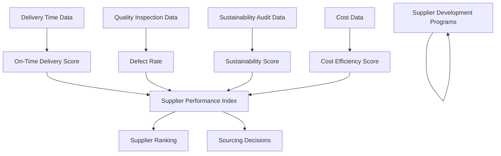

# ChainSight: Pioneering Master Data Management and Data Governance in Fashion Supply Chain Transparency

## Year 1: Laying the Foundations for MDM and Data Governance

When I joined ChainSight as a consultant, the company was set on revolutionizing transparency in the fashion industry. However, they faced significant challenges in managing and governing their data effectively.

"We need to gather, standardize, and verify data from every link in the supply chain," explained Zara, one of the founders. "But how do we ensure this data is accurate, consistent, and trustworthy across all our systems and partners?"

This challenge was at the heart of our Master Data Management (MDM) and Data Governance initiative. We began by implementing fundamental practices:

1. **Identifying Master Data Domains**:
   We identified the core entities that would form our master data:

   - Suppliers
   - Products
   - Materials
   - Facilities (factories, warehouses)
   - Brands (our clients)

2. **Establishing Data Governance Structure**:
   We formed a Data Governance Committee, including:

   - Chief Data Officer (CDO)
   - Representatives from Product, Supply Chain, and IT
   - Data Stewards for each master data domain
   - Myself as MDM and Data Governance Consultant

3. **Defining Data Standards and Policies**:
   We created standards for data format, quality, and management.

   _Example: Product Data Standards_

   ```
   - Product SKU Format: [Brand Code]-[Category Code]-[6-digit number]
     e.g., NK-SHT-123456
   - Product Name: [Brand] [Category] [Descriptive Name]
     e.g., Nike Men's Dri-FIT Running Shirt
   - Color: Use standard color codes from the Pantone Color System
   - Size: Use regional standards (US, EU, UK) with a global size mapping
   - Materials: List in order of highest percentage to lowest, to one decimal place
     e.g., 80% Cotton, 18% Polyester, 2% Elastane
   ```

4. **Implementing Basic MDM Processes**:
   We started with fundamental MDM processes:

   - Data Collection
   - Data Cleansing
   - Data Consolidation
   - Data Enrichment

   _Example: Supplier Data Consolidation and Enrichment_

   ```
   Before MDM:
   1. "Shanghai Textiles Co." - Contact: John Doe, john@shanghaietxtiles.com
   2. "Shanghai Textiles Company" - Contact: J. Doe, john.doe@stc.com
   3. "S.T.C." - No contact information

   After MDM:
   Unified Record:
   - Legal Name: Shanghai Textiles Co., Ltd.
   - Trading Name: STC
   - Unique Supplier ID: SUP-CN-78901
   - Primary Contact: John Doe
   - Contact Email: john.doe@shanghaietxtiles.com
   - Secondary Email: john.doe@stc.com
   - Phone: +86 21 1234 5678
   - Address: 123 Textile Road, Shanghai, 200000, China
   - Sustainability Rating: Silver
   - Certifications: ISO 9001, OEKO-TEX Standard 100
   - Primary Products: Cotton Fabrics, Polyester Blends
   - Production Capacity: 500,000 meters/month
   ```

5. **Creating a Central Data Repository**:
   We established a central database to serve as a single source of truth for all master data.

   _Example: Central Data Repository Schema (Simplified)_

   ```sql
   CREATE TABLE Suppliers (
     SupplierID VARCHAR(20) PRIMARY KEY,
     LegalName VARCHAR(100) NOT NULL,
     TradingName VARCHAR(50),
     PrimaryContact VARCHAR(50),
     Email VARCHAR(100),
     Phone VARCHAR(20),
     Address VARCHAR(200),
     Country VARCHAR(50),
     SustainabilityRating VARCHAR(10),
     DateAdded DATE,
     LastUpdated TIMESTAMP
   );

   CREATE TABLE Products (
     ProductSKU VARCHAR(20) PRIMARY KEY,
     BrandID VARCHAR(10),
     ProductName VARCHAR(100) NOT NULL,
     Category VARCHAR(50),
     SubCategory VARCHAR(50),
     PrimaryMaterial VARCHAR(50),
     LaunchDate DATE,
     IsActive BOOLEAN,
     SustainabilityScore DECIMAL(3,1),
     FOREIGN KEY (BrandID) REFERENCES Brands(BrandID)
   );

   CREATE TABLE SupplierProducts (
     SupplierID VARCHAR(20),
     ProductSKU VARCHAR(20),
     UnitCost DECIMAL(10,2),
     LeadTime INT,
     MinOrderQuantity INT,
     PRIMARY KEY (SupplierID, ProductSKU),
     FOREIGN KEY (SupplierID) REFERENCES Suppliers(SupplierID),
     FOREIGN KEY (ProductSKU) REFERENCES Products(ProductSKU)
   );
   ```

These foundational steps helped ChainSight start managing its core data more effectively, but we knew that achieving true data mastery and governance would require ongoing effort and evolution.

## Year 3: Advanced MDM and Data Governance Implementation

Three years in, ChainSight had partnerships with numerous fashion brands and hundreds of suppliers. Our MDM and data governance needs had grown significantly.

"We're dealing with vast amounts of data from diverse sources," Zara noted. "How can we ensure data consistency and integrity across our entire ecosystem?"

It was time to elevate our MDM and data governance strategies:

1. **Implementing a Robust MDM Solution**:
   We deployed a dedicated MDM software solution with capabilities including:

   - Data modeling and hierarchies
   - Workflow management for data stewardship
   - Data quality management
   - Integration with other enterprise systems

   _Example: Product Hierarchy in MDM_

   ```
   Category: Apparel
   |-- Subcategory: Tops
       |-- Type: T-Shirt
           |-- Style: Crew Neck
               |-- Specific Product: NK-APP-TOP-TSH-CN-123456
                   - Brand: Nike
                   - Name: Men's Dri-FIT Running Shirt
                   - Color: Cosmic Blue (PMS 18-4440)
                   - Sizes: S, M, L, XL, XXL
                   - Material: 100% Recycled Polyester
                   - Features: Moisture-wicking, Odor-resistant
                   - Sustainability Score: 8.5/10
   ```

2. **Enhancing Data Governance Practices**:
   We expanded our data governance framework:

   - Data Ownership Matrix
   - Data Quality Scorecards
   - Data Issue Resolution Process

   _Example: Data Ownership Matrix_

   ```
   | Data Domain   | Executive Owner | Data Steward    | Technical Owner |
   |---------------|-----------------|------------------|-----------------|
   | Supplier      | CPO             | Supplier Manager | MDM Architect   |
   | Product       | COO             | Product Manager  | MDM Architect   |
   | Customer      | CMO             | CRM Manager      | CRM Admin       |
   | Order         | CFO             | Finance Manager  | ERP Admin       |
   | Sustainability| CSO             | Sustainability   | BI Developer    |
   |               |                 | Program Manager  |                 |

   Responsibilities:
   - Executive Owner: Strategic decisions, resource allocation
   - Data Steward: Day-to-day data quality, business rules definition
   - Technical Owner: System configuration, data integration
   ```

   _Example: Data Quality Scorecard for Supplier Data_

   ```
   Metric                 | Score | Target | Trend
   -----------------------|-------|--------|------
   Completeness           | 98%   | 99%    | ↑
   Accuracy               | 97%   | 98%    | ↔
   Consistency            | 95%   | 97%    | ↑
   Timeliness             | 96%   | 98%    | ↓
   Uniqueness             | 99%   | 99%    | ↔
   Validity               | 98%   | 98%    | ↑

   Key Issues:
   1. Missing sustainability certifications for 2% of suppliers
   2. Outdated production capacity data for 4% of suppliers
   3. Inconsistent use of address formats across 5% of supplier records

   Action Items:
   1. Launch supplier data update campaign focusing on certifications
   2. Implement automated quarterly reminders for production capacity updates
   3. Develop and enforce standardized address format across all systems
   ```

   _Example: Data Issue Resolution Process_

   ```
   1. Issue Detection:
      - Automated system alerts
      - User-reported issues
      - Regular data quality audits

   2. Issue Logging:
      - Create ticket in Data Governance platform
      - Assign severity level (Critical, High, Medium, Low)
      - Link to affected data domains and systems

   3. Triage and Assignment:
      - Data Governance team reviews within 24 hours
      - Assign to responsible Data Steward based on domain

   4. Investigation:
      - Data Steward investigates root cause
      - Collaborates with Technical Owner if system-related

   5. Resolution Planning:
      - Develop resolution plan
      - For critical issues: get approval from Executive Owner

   6. Implementation:
      - Execute resolution plan
      - Update affected systems and records
      - Document changes in Data Governance platform

   7. Verification:
      - Quality check by Data Governance team
      - User acceptance testing if applicable

   8. Closure and Learning:
      - Close ticket in Data Governance platform
      - Update documentation and procedures
      - Share learnings in monthly Data Governance meeting

   Example Scenario:
   Issue: Duplicate supplier records detected for "EcoFabrics Ltd."
   Severity: High
   Resolution Time: 48 hours
   Actions Taken:
   - Merged duplicate records
   - Updated 27 associated product records
   - Implemented new data entry validation rule
   - Conducted refresher training for data entry team
   ```

3. **Implementing Data Lineage and Impact Analysis**:
   We developed capabilities to track data lineage and analyze the impact of data changes across our supply chain ecosystem using Neo4j's graph database.

   _Example: Data Lineage for Product Sustainability Score_

   In our Neo4j database, we model various entities as nodes, such as:

   - Data Sources (e.g., Supplier Data, Material Data)
   - Data Transformations (e.g., Product Sustainability Score calculation)
   - Data Consumers (e.g., Brand Sustainability Index, Consumer-facing Product Label)

   These nodes are connected by relationships that represent how data flows between them, such as "CONTRIBUTES_TO" or "USED_IN". This structure allows us to clearly visualize how different data sources contribute to the Product Sustainability Score and how this score is used in various downstream applications.

   ```mermaid
   graph TD
      S[Supplier: EcoFabrics Ltd.]
      M1[Material 1]
      M2[Material 2]
      P1[Product 1]
      P2[Product 2]
      P3[Product 3]
      SS1[SustainabilityScore 1]
      SS2[SustainabilityScore 2]
      SS3[SustainabilityScore 3]
      C1[DataConsumer: Brand Index]
      C2[DataConsumer: Product Label]
      C3[DataConsumer: Reporting Dashboard]

      S -->|SUPPLIES| M1
      S -->|SUPPLIES| M2
      M1 -->|USED_IN| P1
      M1 -->|USED_IN| P2
      M2 -->|USED_IN| P3
      P1 -->|HAS_SCORE| SS1
      P2 -->|HAS_SCORE| SS2
      P3 -->|HAS_SCORE| SS3
      SS1 -->|AFFECTS| C1
      SS1 -->|AFFECTS| C2
      SS2 -->|AFFECTS| C2
      SS3 -->|AFFECTS| C3

      classDef supplier fill:#f9d71c,stroke:#333,stroke-width:2px;
      classDef material fill:#51a3a3,stroke:#333,stroke-width:2px;
      classDef product fill:#75485e,stroke:#333,stroke-width:2px;
      classDef score fill:#cb904d,stroke:#333,stroke-width:2px;
      classDef consumer fill:#dfbbb1,stroke:#333,stroke-width:2px;

      class S supplier;
      class M1,M2 material;
      class P1,P2,P3 product;
      class SS1,SS2,SS3 score;
      class C1,C2,C3 consumer;
   ```

   _Example: Impact Analysis for Changing a Supplier's Sustainability Rating_

   When analyzing the impact of changing a supplier's sustainability rating, our Neo4j-based system allows us to quickly identify:

   - Systems Affected: From Supplier Master Database to Business Intelligence Dashboards
   - Processes Impacted: Including Supplier Evaluation, Product Development, and Strategic Sourcing
   - Data Dependencies: Such as Product Sustainability Scores and Brand Sustainability Rankings
   - Downstream Effects: On Marketing, Sales, and Compliance

   This comprehensive view enables us to estimate the effort required, assess risks, plan implementation, and develop communication strategies.

   _Benefits of using Neo4j for Data Lineage and Impact Analysis:_

   1. **Complex Relationship Modeling**: Neo4j excels at representing and querying the intricate, interconnected data structures typical in our supply chain.
   2. **Performance**: The graph structure allows for fast traversal of relationships, enabling real-time impact analysis of proposed changes.
   3. **Flexibility**: We can easily accommodate new types of entities and relationships as our data ecosystem evolves, without disrupting existing structures.
   4. **Intuitive Visualizations**: Neo4j's visualization capabilities make it easier for non-technical stakeholders to understand data lineage and impacts, improving cross-departmental communication.
   5. **Powerful Querying**: Neo4j's query language allows for complex pattern matching that would be difficult to express in traditional relational databases, enabling more sophisticated analysis.

   _How Neo4j Enhances ChainSight's Capabilities:_

   1. **Tracing Data Lineage**: We can now trace data through complex supply chain relationships, from raw material sourcing to final product sustainability scores, providing unprecedented transparency.
   2. **Rapid Impact Analysis**: When changes are proposed, we can quickly simulate the ripple effects throughout our ecosystem, allowing for more agile decision-making.
   3. **Identifying Hidden Dependencies**: The graph structure reveals connections that might be overlooked in traditional data models, helping us uncover potential risks or opportunities.
   4. **Improved Decision-Making**: With comprehensive, visual representations of data flows, our teams can make more informed decisions about data management and supply chain operations.
   5. **Enhanced Compliance**: We can easily demonstrate data provenance and the impact of changes, supporting our compliance efforts in an increasingly regulated industry.
   6. **Supporting Sustainability Initiatives**: The system allows us to track and analyze sustainability data more effectively, directly supporting our mission of driving sustainability in the fashion industry.

4. **Establishing Data Retention and Archiving Policies**:
   We created policies for the entire data lifecycle:

   - Active Data: Stored in the MDM system and operational databases
   - Archival: Moved to low-cost storage after 2 years of inactivity
   - Deletion: Permanently removed after 7 years unless legally required to retain

5. **Implementing Master Data Governance Workflows**:
   We set up automated workflows for master data management:

   - New Data Creation
   - Data Updates
   - Data Merging

   _Example: New Supplier Onboarding Workflow_

   ```
   1. Supplier submits information through a standardized web form
   2. Automated data validation checks for completeness and format
   3. Data steward reviews the submission
   4. System checks for potential duplicates against existing records
   5. If duplicates found, data steward reviews and decides on merge action
   6. If no duplicates, new supplier record is created in MDM
   7. MDM system propagates new supplier data to relevant downstream systems
   8. Notification sent to Procurement, Finance, and Sustainability departments
   9. Initial supplier audit scheduled automatically
   ```

These advancements significantly improved our ability to maintain high-quality, consistent master data across our growing ecosystem. By implementing these strategies, ChainSight has positioned itself at the forefront of data-driven supply chain management in the fashion industry, enabling us to drive transparency and sustainability more effectively than ever before.

# Year 6: Scaling MDM and Data Governance for Global Impact with Collibra and MEGA HOPEX

## 1. Implementing Collibra for Comprehensive Data Governance

a) **Data Catalog and Business Glossary**

To ensure consistency and clarity across our global operations, we implemented a comprehensive data catalog and business glossary in Collibra. This standardized our terminology and improved communication across departments and regions.

Example: Product Lifecycle Management Terms

```
Term: Product Development Cycle
Definition: The time from initial product concept to market launch
Calculation: Launch Date - Concept Approval Date
Owner: Product Development Team
Related Terms: Concept Approval, Design Phase, Sampling, Production
Used In: Product Planning, Resource Allocation, Performance Metrics

Term: Sustainable Material Index
Definition: A score (0-100) indicating a material's overall sustainability
Calculation: (Recycled Content % * 0.3) + (Water Usage Score * 0.3) + (Carbon Footprint Score * 0.4)
Owner: Materials Research Team
Related Terms: Recycled Content, Water Usage, Carbon Footprint
Used In: Material Selection, Product Sustainability Score, Supplier Evaluation
```

This standardized glossary enabled teams across different regions to speak the same language when discussing product development and sustainability, significantly reducing misunderstandings and improving collaboration.

b) **Data Lineage and Impact Analysis**

We utilized Collibra's data lineage capabilities to map the flow of critical data across our systems. This allowed us to quickly assess the impact of any data changes and trace the origin of any data quality issues.

Example: Supplier Performance Metric Lineage



This data lineage mapping helped us quickly identify the root causes of supplier performance issues and understand the downstream effects of any changes in our supplier evaluation process.

c) **Policy Management and Workflow Automation**

We implemented automated workflows in Collibra to streamline our data governance processes, ensuring consistency and reducing manual errors.

Example: New Supplier Onboarding Workflow in Collibra

```
1. Procurement submits new supplier request
2. System checks for potential duplicates
3. If no duplicates, create new supplier profile
4. Trigger automated requests for:
   - Financial information (to Finance team)
   - Compliance documents (to Legal team)
   - Sustainability assessment (to Sustainability team)
5. Each team reviews and approves in Collibra
6. Once all approvals received, supplier status updated to "Active"
7. Automated notifications sent to relevant systems (ERP, SCM, etc.)
8. Collibra logs all actions for audit trail
```

This automated workflow reduced our supplier onboarding time from weeks to days, ensuring all necessary checks were completed consistently and efficiently.

d) **Data Quality Management**

We established a robust set of data quality rules in Collibra to continuously monitor and improve the quality of our master data.

Example: Material Master Data Quality Rules in Collibra

```
Rule 1: Material Code Uniqueness
- Check: No duplicate material codes allowed
- Action: Flag duplicates for review

Rule 2: Material Sustainability Score Completeness
- Check: All materials must have a sustainability score
- Action: Alert Materials team for missing scores

Rule 3: Material Composition Accuracy
- Check: Sum of composition percentages must equal 100%
- Action: Flag for correction if sum ≠ 100%

Rule 4: Hazardous Material Classification
- Check: All materials must have hazard classification
- Action: Notify Safety team for missing classifications

Monthly Data Quality Report:
Metric                    | Score | Trend
--------------------------|-------|------
Material Code Uniqueness  | 100%  | ↔
Sustainability Score      | 98.7% | ↑
Composition Accuracy      | 99.5% | ↑
Hazard Classification     | 97.8% | ↑
```

These data quality rules significantly improved the accuracy and completeness of our material master data, which in turn enhanced our ability to make informed decisions about material selection and product sustainability.

## 2. Leveraging MEGA HOPEX for Enterprise Architecture and Risk Management

a) **Enterprise Architecture Modeling**

We used MEGA HOPEX to model our enterprise architecture, providing a clear view of how our data systems interact and support our business processes.

Example: Data Architecture for Product Traceability

```
[Product Traceability System]
|-- Data Sources
    |-- Supplier Management System
        - Supplier Details
        - Material Sourcing Information
    |-- Manufacturing Execution System
        - Production Batch Data
        - Quality Control Results
    |-- Logistics Management System
        - Shipment Tracking Data
        - Customs Documentation
|-- Data Integration Layer
    - ETL Processes
    - Data Validation Rules
|-- Master Data Management
    - Product Master
    - Supplier Master
    - Materials Master
|-- Analytics Engine
    - Traceability Algorithms
    - Chain of Custody Validation
|-- Presentation Layer
    - Traceability Dashboard
    - Consumer-Facing Product History
```

This architectural model helped us identify data flow bottlenecks and optimize our systems for improved product traceability, a key factor in our sustainability initiatives.

b) **Risk and Compliance Management**

MEGA HOPEX enabled us to integrate data-related risks into our overall risk management framework, ensuring comprehensive coverage of potential vulnerabilities.

Example: Data Breach Risk Assessment in MEGA HOPEX

```
Risk: Unauthorized Access to Customer Data
Likelihood: Medium (3/5)
Impact: High (4/5)
Risk Score: 12/25 (High)

Affected Assets:
- Customer Database
- Order Management System
- Customer Service Portal

Compliance Requirements:
- GDPR Article 32 (Security of Processing)
- PCI DSS Requirement 3 (Protect Stored Cardholder Data)

Controls:
1. Encryption of Data at Rest
   - Implementation: AES 256-bit encryption
   - Effectiveness: High
2. Multi-Factor Authentication
   - Implementation: For all system access
   - Effectiveness: High
3. Regular Penetration Testing
   - Implementation: Quarterly
   - Effectiveness: Medium

Residual Risk Score: 6/25 (Medium)

Action Plan:
1. Implement Data Loss Prevention (DLP) solution
2. Enhance logging and monitoring capabilities
3. Conduct additional employee training on data handling
```

This risk assessment approach allowed us to prioritize our data protection efforts and allocate resources more effectively, significantly reducing our exposure to data-related risks.

c) **IT Portfolio Management**

We utilized MEGA HOPEX for IT portfolio management, ensuring our technology investments aligned with our business goals and data governance needs.

Example: MDM Tool Evaluation in MEGA HOPEX

```
Criteria Weights:
1. Data Governance Capabilities: 25%
2. Integration with Existing Systems: 20%
3. Scalability: 20%
4. User Interface & Ease of Use: 15%
5. Vendor Support & Training: 10%
6. Cost: 10%

Evaluation Matrix:
Tool        | Gov | Int | Scal | UI  | Supp | Cost | Total
------------|-----|-----|------|-----|------|------|------
Collibra    | 9   | 8   | 9    | 8   | 9    | 7    | 8.45
Informatica | 8   | 9   | 8    | 7   | 8    | 6    | 7.85
Talend      | 7   | 7   | 8    | 9   | 7    | 8    | 7.60

Recommendation: Implement Collibra for its strong governance capabilities and scalability, which align with our global expansion plans.
```

This structured evaluation process ensured that our MDM tool selection was based on objective criteria aligned with our strategic needs, leading to a more successful implementation.

## 3. Implementing a Federated Data Governance Model

To balance global standards with local needs, we implemented a federated data governance model, leveraging both Collibra and MEGA HOPEX.

Example: Global-Local Data Quality Management Process

```
Global Data Quality Policy:
1. All master data must meet 98% accuracy
2. Data quality checks run daily
3. Critical issues addressed within 24 hours

EU Region Implementation:
- Additional check: GDPR compliance for personal data
- Local DQ team: 3 members in Berlin office
- Escalation path: Local DQ Manager > EU Data Governance Lead > Global CDO

APAC Region Implementation:
- Additional check: Chinese character encoding validation
- Local DQ team: 2 members in Singapore, 1 in Shanghai
- Escalation path: Local DQ Manager > APAC Data Governance Lead > Global CDO

Process Flow:
1. Collibra runs daily data quality checks
2. Results fed into regional Collibra dashboards
3. Local DQ teams review and address issues
4. Weekly report generated in MEGA HOPEX for global overview
5. Monthly cross-regional DQ review led by Global Data Governance Council
```

This federated model allowed us to maintain global data quality standards while accommodating regional regulatory requirements and local data nuances, significantly improving our overall data governance effectiveness.

## Results and Impact

The implementation of Collibra and MEGA HOPEX, along with our federated data governance model, yielded significant improvements across our organization:

Quantitative Improvements:

1. Data Quality: Increased from 92% to 98.5%

   - Supplier data accuracy: 99.2%
   - Product data completeness: 98.7%
   - Customer data validity: 97.9%

2. Operational Efficiency:

   - Reduced time for data-related decision making by 60%
   - New product introduction cycle shortened by 25%
   - Supplier onboarding time decreased from 3 weeks to 5 days

3. Risk Management:

   - Data-related risk incidents decreased by 75%
   - Average time to detect data anomalies reduced from 5 days to 4 hours

4. Compliance:

   - Achieved 100% compliance with GDPR, CCPA, and industry-specific regulations
   - Audit preparation time reduced by 70%

5. Cost Savings:
   - $5M annual savings through optimized data management
   - $2M reduction in compliance-related costs
   - $1.5M saved by eliminating redundant data systems

Qualitative Improvements:

1. Enhanced trust from partners and customers due to data transparency
2. Improved ability to adapt to new regulations quickly
3. Better alignment between IT initiatives and business objectives
4. Increased employee satisfaction with data accessibility and quality

Testimonial:
"The implementation of Collibra and MEGA HOPEX has transformed our data landscape. We now have a 360-degree view of our supply chain, enabling us to make faster, more informed decisions. This has not only improved our operational efficiency but has also positioned us as a leader in sustainable and transparent fashion supply chains. Our ability to provide real-time, accurate data has made us the preferred partner for brands committed to ethical and sustainable practices."

These results demonstrate the transformative impact of our advanced MDM and data governance initiatives, positioning us as a leader in data-driven, sustainable fashion supply chain management.

# My Journey in Data Governance and MDM: From Basics to Advanced Tools

## Introduction

As an Enterprise Data Architect at ChainSight, I've had the privilege of leading a transformative journey in Data Governance (DG) and Master Data Management (MDM). This project has been an incredible learning curve, taking me from the basics of data management to implementing cutting-edge tools that have revolutionized our approach to data.

## The Early Days: Building from Scratch

### Year 1-2: Laying the Foundation

When I joined ChainSight, we were facing significant challenges with data inconsistencies and silos. Our first steps were focused on establishing the fundamental principles of DG and MDM:

1. **Data Audit and Assessment**:

   - Used Python scripts to analyze data quality across systems
   - Wrote SQL queries to identify data discrepancies and duplicates

2. **Establishing Basic Data Governance**:

   - Created a Data Governance Committee
   - Developed initial data policies and standards

3. **Implementing a Basic MDM System**:
   - Built a centralized data repository using SQL databases
   - Developed Python scripts for data cleansing and de-duplication

**Learning Experience**: This phase was crucial in understanding the core principles of DG and MDM. Writing Python scripts and SQL queries from scratch gave me a deep appreciation for the intricacies of data management.

## The Middle Years: Scaling and Automation

### Year 3-4: Advanced Implementation

As our data needs grew, we needed more sophisticated solutions:

1. **Data Lineage and Impact Analysis**:

   - Implemented Neo4j graph database
   - Wrote Cypher queries to model complex data relationships

2. **Automated Data Quality Checks**:

   - Developed machine learning models in Python for anomaly detection
   - Created automated data profiling scripts

3. **API-driven Data Integration**:
   - Built RESTful APIs using Flask for real-time data synchronization
   - Implemented OAuth 2.0 for secure data access

**Learning Curve**: This period was transformative. I delved deep into graph databases, machine learning, and API development. The complexity of our data ecosystem pushed me to explore advanced coding techniques and architectural patterns.

## The Recent Years: Embracing Enterprise Tools

### Year 5-6: Implementing Enterprise Solutions

As ChainSight expanded globally, we needed enterprise-grade tools to standardize our DG and MDM practices:

1. **Collibra for Data Governance**:

   - Implemented a company-wide data catalog and business glossary
   - Configured automated data quality rules and workflows

2. **MEGA HOPEX for Enterprise Architecture**:

   - Modeled our entire data architecture
   - Integrated risk management and compliance into our data governance framework

3. **Federated Data Governance Model**:
   - Customized Collibra and MEGA HOPEX to support a global-local governance structure
   - Implemented role-based access control and data stewardship programs

**The Transition to Low-Code/No-Code**:
The shift to enterprise tools like Collibra and MEGA HOPEX was a game-changer. Having built data pipelines from scratch in the early years, I had a profound appreciation for what these tools were doing under the hood. This background knowledge was invaluable in:

- Configuring tools effectively to meet our specific needs
- Understanding the limitations and potential workarounds
- Bridging the gap between technical capabilities and business requirements
- Training our team to use these tools effectively, explaining complex concepts in relatable terms

## Reflection and Lessons Learned

This journey from basic DG and MDM principles to advanced enterprise tools has been incredibly rewarding:

1. **Strong Foundation**: Starting with pure Python and SQL gave me a deep understanding of data management challenges and solutions.

2. **Appreciation for Tools**: The transition to low-code/no-code tools was smooth because I understood the underlying principles. I could appreciate the efficiency and power these tools brought to our operations.

3. **Bridging Technical and Business**: My journey equipped me to communicate effectively with both technical teams and business stakeholders, translating complex data concepts into business value.

4. **Continuous Learning**: The field of data management is ever-evolving. This project has instilled in me a passion for continuous learning and adaptation.

5. **Holistic View**: Moving from coding individual solutions to implementing enterprise-wide tools has given me a more holistic view of data governance and its impact on organizational success.

6. **Efficiency Gains**: The transition from manual coding to enterprise tools dramatically increased our efficiency. Here's a concrete example:

   **Task: Implementing and Maintaining a Data Lineage System**

   _With Python and SQL:_

   - Wrote custom Python scripts to extract metadata from various data sources (2-3 days)
   - Designed and implemented a SQL database to store lineage information (1-2 days)
   - Created a web interface using Flask to visualize the lineage (3-4 days)
   - Manually updated lineage information when data flows changed (ongoing, 1-2 hours per change)
   - Wrote additional scripts for impact analysis (2-3 days)
   - Total: 8-12 days initial setup, plus ongoing maintenance

   _With Collibra and MEGA HOPEX:_

   - Configured Collibra to automatically harvest metadata from data sources (4-6 hours)
   - Used MEGA HOPEX's built-in data lineage modeling features (2-3 hours)
   - Leveraged Collibra's out-of-the-box lineage visualization (1-2 hours)
   - Set up automated lineage updates through Collibra's integration features (2-3 hours)
   - Utilized MEGA HOPEX's impact analysis capabilities (1-2 hours)
   - Total: 1-2 days initial setup, minimal ongoing maintenance

   This example illustrates how enterprise tools not only saved us significant time in setup but also reduced ongoing maintenance efforts. More importantly, they provided a more robust, scalable, and user-friendly solution that business users could easily interact with, enhancing the overall value of our data governance efforts.

In conclusion, this project has been a fantastic journey of growth and learning. It has reinforced my belief that a strong understanding of fundamentals, combined with the ability to leverage advanced tools, is key to success in the world of enterprise data architecture. The transition from manual coding to enterprise solutions like Collibra and MEGA HOPEX has not only improved our efficiency but has also elevated the strategic impact of our data governance initiatives.

# My Potential Journey in Telco Data Governance and MDM: Elevating Existing Frameworks

## Introduction

As an experienced Enterprise Data Architect transitioning into the Telco industry, I could bring a unique perspective to Data Governance (DG) and Master Data Management (MDM). While many Telcos have already implemented standard setups like Collibra and LeanIX, along with established DG frameworks, my diverse background would allow me to identify opportunities for optimization and innovation within these existing structures.

## Leveraging Existing Frameworks

### Initial Assessment and Gap Analysis

Upon joining a Telco organization, my first steps would involve:

1. **Evaluating Current DG and MDM Maturity**:

   - I could analyze the existing Collibra implementation for data catalog completeness and usage
   - I would review LeanIX architecture models for alignment with current business processes
   - I could assess the effectiveness of established data governance policies and procedures

   How I would do this:

   - Conduct stakeholder interviews across IT and business units
   - Perform a detailed audit of Collibra usage metrics and LeanIX model coverage
   - Use a maturity assessment framework (e.g., DMBOK, DAMA) to benchmark current practices

2. **Identifying Integration Opportunities**:

   - I would explore potential synergies between Collibra's data governance capabilities and LeanIX's enterprise architecture insights
   - I could evaluate the current state of data flow between operational systems and governance tools

   How I would do this:

   - Map out current integrations and data flows using tools like draw.io or Lucidchart
   - Analyze API capabilities of both Collibra and LeanIX
   - Conduct workshops with key stakeholders to identify pain points in current integrations

3. **Benchmarking Against Industry Standards**:

   - I would compare the organization's DG and MDM practices with TM Forum's frameworks and best practices
   - I could identify areas where the current implementation falls short of industry benchmarks

   How I would do this:

   - Utilize TM Forum's Data Management Maturity Model for assessment
   - Engage with industry peers through forums and conferences to gather insights
   - Conduct a SWOT analysis of current DG and MDM practices against industry leaders

## Enhancing Existing Systems

### Optimizing Collibra Usage

1. **Advanced Data Lineage**:

   - I could implement end-to-end lineage tracking for critical data elements like customer information and network performance metrics
   - I would develop custom lineage visualizations to make complex data flows understandable to business users

   How I would do this:

   - Leverage Collibra's Edge scanning capabilities to automate lineage capture
   - Develop custom Python scripts to enhance lineage metadata where needed
   - Use Collibra's DIagram API to create tailored visualizations

2. **Automated Data Quality Management**:

   - I could integrate machine learning models for anomaly detection in subscriber data
   - I would implement predictive data quality scoring for proactive issue resolution

   How I would do this:

   - Develop anomaly detection models using Python libraries like scikit-learn or TensorFlow
   - Integrate these models with Collibra's data quality framework using REST APIs
   - Implement a custom scoring algorithm based on historical data quality patterns

### Extending LeanIX Capabilities

1. **Dynamic Architecture Modeling**:

   - I could develop scripts to automatically update LeanIX models based on changes in the network infrastructure
   - I would create custom visualizations to show the impact of architectural changes on data flows

   How I would do this:

   - Utilize LeanIX's REST API to programmatically update architecture models
   - Develop a middleware solution to sync network changes with LeanIX in real-time
   - Create custom reports and dashboards using LeanIX's reporting features

2. **Integration with Operational Systems**:

   - I could build APIs to enable real-time synchronization between LeanIX and network management systems
   - I would implement webhooks to trigger architecture reviews based on significant system changes

   How I would do this:

   - Develop RESTful APIs using frameworks like Flask or FastAPI
   - Implement an event-driven architecture using tools like Apache Kafka for real-time data streaming
   - Set up webhooks in LeanIX to trigger automated workflows in tools like Jira or ServiceNow

## Innovating Within the Existing Framework

### Implementing AI-Driven Governance

1. **Natural Language Processing for Policy Compliance**:

   - I could develop NLP models to analyze and categorize unstructured data for compliance with data governance policies
   - I would implement an AI-assisted chatbot to help employees navigate data governance rules

   How I would do this:

   - Utilize NLP libraries like spaCy or NLTK to develop custom models for policy analysis
   - Train models on existing policy documents and compliance reports
   - Develop a chatbot using platforms like Rasa or Dialogflow, integrated with Collibra's knowledge base

2. **Predictive Impact Analysis**:

   - I could create machine learning models to predict the impact of proposed data changes on downstream systems and processes
   - I would integrate these predictions into the change management workflow in Collibra

   How I would do this:

   - Develop predictive models using techniques like random forests or gradient boosting
   - Utilize Collibra's workflow engine to incorporate model predictions into change management processes
   - Implement A/B testing to continuously improve model accuracy

### Enhancing Customer Data Management

1. **360-Degree Customer View**:

   - I could leverage my experience in MDM to create a unified customer profile, integrating data from CRM, billing, and network usage systems
   - I would implement real-time data quality checks to ensure the accuracy of the unified customer profile

   How I would do this:

   - Implement a data virtualization layer using tools like Denodo or Informatica
   - Develop a custom MDM solution or leverage existing MDM platforms
   - Implement real-time data quality checks using stream processing technologies like Apache Flink

2. **Privacy-Preserving Analytics**:

   - I could introduce differential privacy techniques for customer data analysis, enabling more robust analytics while maintaining GDPR compliance
   - I would develop a metadata tagging system in Collibra to track data sensitivity and usage permissions

   How I would do this:

   - Implement differential privacy algorithms using libraries like IBM's diffprivlib
   - Extend Collibra's metadata model to include privacy-related attributes
   - Develop custom privacy impact assessment workflows in Collibra

## Bridging Technical and Business Perspectives

1. **Data Monetization Strategies**:

   - I could collaborate with business teams to identify opportunities for data monetization within regulatory constraints
   - I would develop a framework for assessing the value and risk of data assets, integrated into the Collibra data catalog

   How I would do this:

   - Conduct value stream mapping workshops with business stakeholders
   - Develop a custom scoring model for data asset valuation
   - Implement the scoring model as a custom attribute in Collibra's data catalog

2. **KPI-Driven Governance**:

   - I could implement a balanced scorecard approach to measure the effectiveness of data governance initiatives
   - I would create executive dashboards in LeanIX to visualize the impact of data quality on key business metrics

   How I would do this:

   - Define key performance indicators (KPIs) for data governance in collaboration with stakeholders
   - Implement data collection mechanisms for these KPIs using Collibra's reporting capabilities
   - Develop custom reports and dashboards in LeanIX to visualize KPI performance

## Reflection on Potential Contributions

My experience in elevating DG and MDM frameworks could be incredibly valuable to a Telco organization:

1. **Building on Solid Foundations**: With established tools like Collibra and LeanIX in place, I could quickly identify areas for enhancement and innovation.

2. **Balancing Standardization and Innovation**: While working within established frameworks, I could introduce cutting-edge techniques like AI and machine learning, demonstrating that innovation can thrive within standardized environments.

3. **Cross-Industry Insights**: My background in supply chain data management could bring fresh perspectives to Telco data challenges, particularly in areas like end-to-end data lineage and predictive analytics.

4. **Holistic Approach**: I could integrate data governance with enterprise architecture through Collibra and LeanIX, providing a more comprehensive view of data's role in the organization.

5. **Continuous Adaptation**: In the rapidly evolving Telco landscape, with emerging technologies like 5G and IoT, I could implement flexible and adaptive data governance strategies.

In conclusion, my potential journey in enhancing DG and MDM practices in the Telco industry could show that even in environments with established frameworks, there's always room for optimization and innovation. By leveraging my diverse experience and focusing on both technological advancements and business value, I could significantly elevate the organization's data management capabilities, positioning the company for future success in an increasingly data-driven industry.
